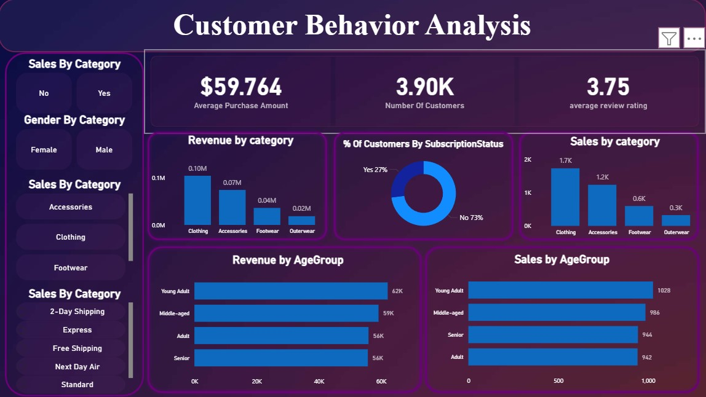

# 🛍️ Customer Shopping Behavior Analysis

## 📌 Project Overview
This project analyzes customer shopping behavior using a dataset of **3,900 transactions**. The objective is to uncover spending patterns, segment customers based on loyalty and demographics, and generate data-driven recommendations to improve subscription rates and overall revenue.

---

## 📊 Interactive Dashboard



> ⚠️ Ensure `dashboard.jpg` is uploaded to the root directory of this repository for the image to display correctly.

---

## 🚀 Key Insights & KPIs
- **Total Transactions:** 3,900  
- **Average Purchase Value:** $59.76  
- **Average Review Rating:** 3.75 / 5.0  

### 📈 Business Insights
- **Revenue by Gender:**  
  - Male: $157,890  
  - Female: $75,191  

- **Top-Selling Categories:**  
  - Blouses and Jewelry (171 orders each)

- **Shipping Impact:**  
  - Express Shipping: $60.48 average spend  
  - Standard Shipping: $58.46 average spend  

---

## 🛠️ Tech Stack
- **Python (Pandas):** Data cleaning, preprocessing, and feature engineering  
- **PostgreSQL:** Advanced querying and segmentation analysis  
- **Power BI:** Interactive dashboard and data visualization  

---

## 📂 Project Workflow

### 1️⃣ Data Preparation (Python)
- Cleaned dataset by imputing **37 missing review ratings** using category medians  
- Standardized column names to **snake_case** for database compatibility  
- Performed feature engineering by creating **age group segments**:
  - Young Adult  
  - Middle-aged  
  - Adult  
  - Senior  

---

### 2️⃣ SQL Analysis
- **Subscription Opportunity:**  
  Identified **2,518 repeat buyers** (5+ purchases) who are not subscribed  

- **Customer Loyalty:**  
  Found that **79% (3,116 customers)** are classified as loyal  

- **Behavioral Insights:**  
  Discovered **839 customers** who used discounts while still spending above average  

---

### 3️⃣ Data Visualization (Power BI)
- Built an interactive dashboard with:
  - KPI cards  
  - Revenue trends  
  - Customer segmentation visuals  

- Key findings:
  - **Young Adults ($62,143)** and **Middle-aged ($59,197)** are top revenue contributors  

- Implemented filters for:
  - Subscription Status  
  - Gender  
  - Product Category  

---

## 💡 Strategic Recommendations
- **Convert High-Value Customers:**  
  Target the **2,518 repeat buyers** with personalized subscription campaigns  

- **Promote Express Shipping:**  
  Encourage usage as it correlates with higher average order value  

- **Gender-Based Marketing:**  
  Address the **2.1× spending gap** by improving engagement strategies for female customers  

- **Enhance Customer Feedback:**  
  Increase review ratings by incentivizing feedback on top-selling products  

---

## ▶️ How to Run

```bash
# Clone the repository
git clone https://github.com/your-username/your-repo-name.git

# Navigate to the project folder
cd your-repo-name

# Install dependencies
pip install -r requirements.txt

# Launch Jupyter Notebook
jupyter notebook
